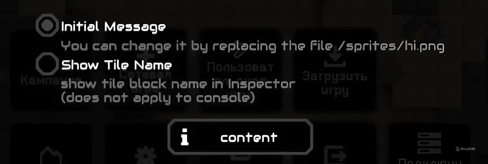

# JavaScript-Mod
My First JavaScript Mod (There's also a bit of Ash Jason in it)

# JavaScript Content 

  -r0uter

     max health 
     have lightning

  -feedbacker

     Ultrakill reference 
     +paryy
     have custome paryy soun
     dont parry lasers
 
  -VarWall 

     it's experement
     health is var
     can only be placed on sand (not on black)
   
  -ispectator 

     checks and displays the name (ID) of the surface on which it was placed (can be customized)

  -menu

     have simple menu

  -tur

     have custom particles 

  -sentry

     have PointBulletType

  -detk

     has increased damage to working energy

  -xyeta (I/II)

     -I

      may shoot after some time

     -II

      can't shoot

  -pmd

     basic Payload Mass Driver

  -initial message

     can be customized(../sprites/hi.png)
     can be turned off in special settings

  -JSM Setings
  

# Hjson Content

  -mini constructor

    it's unitAssembler 
    create fortress
    does not require energy
   
  -wall assembler
  
    create all 1x1 walls
    requires 6 water per second
  